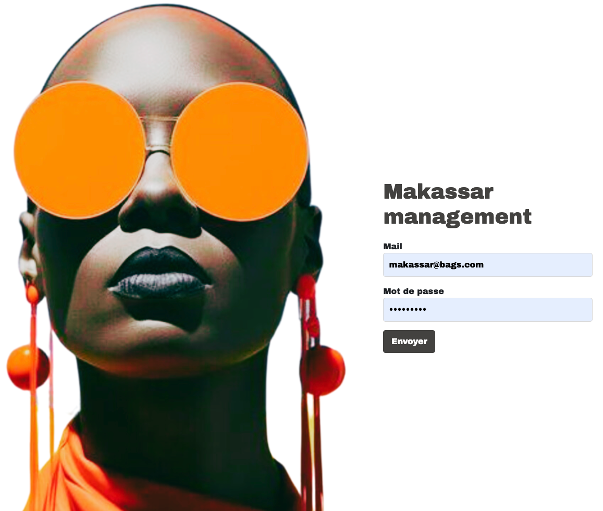
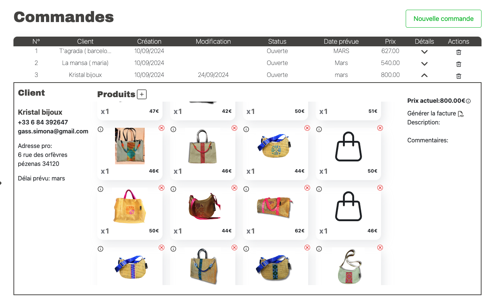
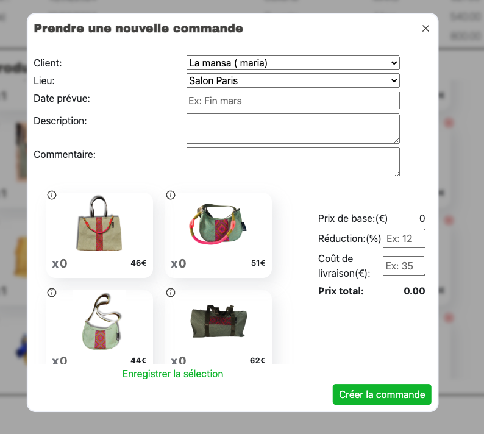
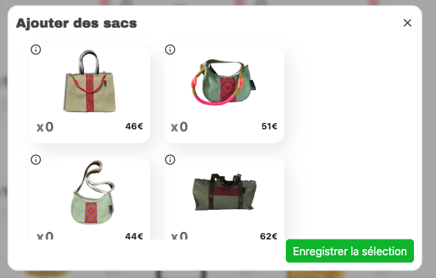

# Makasssar management frontend

### Features

- User authentification
- JWT protected routes
- Orders : take orders and get their invoices
- Clients : CRUD
- Products : CRUD

### App screens

    <!--  -->

    

    
    

